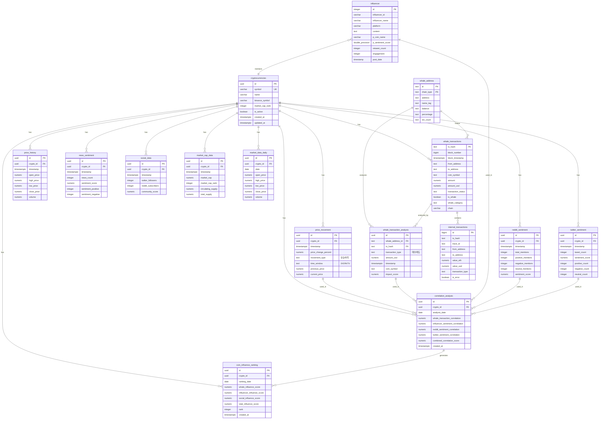
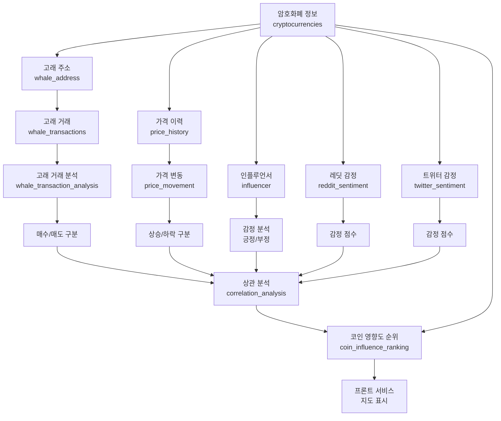

# 🗄️ Whale Tracking System ERD (Entity Relationship Diagram)

## 📊 목표 달성을 위한 데이터베이스 구조

### 🎯 시스템 목표
1. **데이터 수집**: 고래 주소 → 거래기록 → 고래별 거래기록
2. **SNS 포스트**: 레딧, 트위터 → 인플루언서의 포스트
3. **데이터 분석**: 코인 가격(상승/하락) vs 고래 거래(매수/매도) + 인플루언서 감정(긍정/부정)
4. **프론트 서비스**: 코인별 영향도 순위를 지도에 표시

---

## 📋 현재 존재하는 테이블 (12개)

### ✅ 핵심 테이블
- `cryptocurrencies` - 암호화폐 기본 정보
- `whale_address` - 고래 지갑 주소
- `whale_transactions` - 고래 거래 기록
- `influencer` - 인플루언서 포스트
- `price_history` - 가격 이력

### ✅ 보조 테이블
- `internal_transactions` - 내부 거래
- `market_cap_data` - 시가총액 데이터
- `market_data_daily` - 일일 시장 데이터
- `news_sentiment` - 뉴스 감정 분석
- `reddit_sentiment` - 레딧 감정 분석
- `social_data` - 소셜 미디어 데이터
- `prediction_accuracy` - 예측 정확도

---

## ❌ 추가해야 할 테이블 (5개)

### 🔴 필수 테이블
1. **whale_transaction_analysis** - 고래별 거래 분석 (매수/매도 구분)
2. **price_movement** - 가격 변동 분석 (상승/하락)
3. **correlation_analysis** - 상관 분석 결과 저장
4. **coin_influence_ranking** - 코인별 영향도 순위 (프론트 표시용)

### 🟡 선택 테이블
5. **twitter_sentiment** - 트위터 감정 분석 (별도 테이블)

---

## 🔗 ERD 다이어그램



---

## 📈 데이터 흐름도



---

## 🔑 주요 관계 요약

### 1. 고래 거래 분석 흐름
- `whale_address` → `whale_transactions` → `whale_transaction_analysis`
- 목적: 고래별 매수/매도 거래 분석

### 2. 가격 변동 분석 흐름
- `price_history` → `price_movement`
- 목적: 코인 가격 상승/하락 분석

### 3. SNS 감정 분석 흐름
- `influencer` → 감정 분석 (긍정/부정)
- `reddit_sentiment` → 레딧 감정 점수
- `twitter_sentiment` → 트위터 감정 점수

### 4. 상관 분석 흐름
- `whale_transaction_analysis` + `price_movement` + `influencer` + `reddit_sentiment` + `twitter_sentiment`
- → `correlation_analysis` → `coin_influence_ranking`

---

## 📝 추가 테이블 상세 스키마

### 1. whale_transaction_analysis
```sql
CREATE TABLE whale_transaction_analysis (
    id UUID PRIMARY KEY DEFAULT gen_random_uuid(),
    whale_address_id TEXT NOT NULL,
    tx_hash TEXT NOT NULL,
    transaction_type TEXT NOT NULL, -- 'BUY' or 'SELL'
    amount_usd NUMERIC(20, 2) NOT NULL,
    timestamp TIMESTAMPTZ NOT NULL,
    coin_symbol TEXT NOT NULL,
    impact_score NUMERIC(10, 4),
    created_at TIMESTAMPTZ DEFAULT NOW(),
    FOREIGN KEY (whale_address_id, chain_type) REFERENCES whale_address(id, chain_type),
    FOREIGN KEY (tx_hash) REFERENCES whale_transactions(tx_hash)
);
```

### 2. price_movement
```sql
CREATE TABLE price_movement (
    id UUID PRIMARY KEY DEFAULT gen_random_uuid(),
    crypto_id UUID NOT NULL,
    timestamp TIMESTAMPTZ NOT NULL,
    price_change_percent NUMERIC(10, 4) NOT NULL,
    movement_type TEXT NOT NULL, -- 'UP' or 'DOWN'
    time_window TEXT NOT NULL, -- '1h', '24h', '7d', '30d'
    previous_price NUMERIC(20, 8),
    current_price NUMERIC(20, 8),
    created_at TIMESTAMPTZ DEFAULT NOW(),
    FOREIGN KEY (crypto_id) REFERENCES cryptocurrencies(id)
);
```

### 3. correlation_analysis
```sql
CREATE TABLE correlation_analysis (
    id UUID PRIMARY KEY DEFAULT gen_random_uuid(),
    crypto_id UUID NOT NULL,
    analysis_date DATE NOT NULL,
    whale_transaction_correlation NUMERIC(5, 4), -- -1 to 1
    influencer_sentiment_correlation NUMERIC(5, 4),
    reddit_sentiment_correlation NUMERIC(5, 4),
    twitter_sentiment_correlation NUMERIC(5, 4),
    combined_correlation_score NUMERIC(5, 4),
    created_at TIMESTAMPTZ DEFAULT NOW(),
    FOREIGN KEY (crypto_id) REFERENCES cryptocurrencies(id),
    UNIQUE(crypto_id, analysis_date)
);
```

### 4. coin_influence_ranking
```sql
CREATE TABLE coin_influence_ranking (
    id UUID PRIMARY KEY DEFAULT gen_random_uuid(),
    crypto_id UUID NOT NULL,
    ranking_date DATE NOT NULL,
    whale_influence_score NUMERIC(10, 4),
    influencer_influence_score NUMERIC(10, 4),
    social_influence_score NUMERIC(10, 4),
    total_influence_score NUMERIC(10, 4) NOT NULL,
    rank INTEGER NOT NULL,
    created_at TIMESTAMPTZ DEFAULT NOW(),
    FOREIGN KEY (crypto_id) REFERENCES cryptocurrencies(id),
    UNIQUE(crypto_id, ranking_date)
);
```

### 5. twitter_sentiment
```sql
CREATE TABLE twitter_sentiment (
    id UUID PRIMARY KEY DEFAULT gen_random_uuid(),
    crypto_id UUID NOT NULL,
    timestamp TIMESTAMPTZ NOT NULL,
    tweet_count INTEGER,
    sentiment_score NUMERIC(5, 4), -- -1 to 1
    positive_count INTEGER,
    negative_count INTEGER,
    neutral_count INTEGER,
    created_at TIMESTAMPTZ DEFAULT NOW(),
    FOREIGN KEY (crypto_id) REFERENCES cryptocurrencies(id)
);
```

---

## 🎯 목표 달성 체크리스트

### ✅ 현재 완료
- [x] 고래 주소 수집 (whale_address)
- [x] 고래 거래 기록 수집 (whale_transactions)
- [x] 인플루언서 포스트 수집 (influencer)
- [x] 레딧 감정 분석 (reddit_sentiment)
- [x] 가격 이력 수집 (price_history)

### ❌ 추가 필요
- [ ] 고래별 거래 분석 테이블 (whale_transaction_analysis)
- [ ] 가격 변동 분석 테이블 (price_movement)
- [ ] 트위터 감정 분석 테이블 (twitter_sentiment)
- [ ] 상관 분석 테이블 (correlation_analysis)
- [ ] 코인 영향도 순위 테이블 (coin_influence_ranking)

---

## 📊 분석 쿼리 예시

### 1. 고래 거래와 가격 변동 상관관계
```sql
SELECT 
    c.symbol,
    AVG(wta.amount_usd) as avg_whale_amount,
    COUNT(CASE WHEN wta.transaction_type = 'BUY' THEN 1 END) as buy_count,
    COUNT(CASE WHEN wta.transaction_type = 'SELL' THEN 1 END) as sell_count,
    AVG(pm.price_change_percent) as avg_price_change,
    CORR(wta.amount_usd, pm.price_change_percent) as correlation
FROM whale_transaction_analysis wta
JOIN price_movement pm ON wta.coin_symbol = c.symbol 
    AND DATE_TRUNC('day', wta.timestamp) = DATE_TRUNC('day', pm.timestamp)
JOIN cryptocurrencies c ON c.symbol = wta.coin_symbol
GROUP BY c.symbol;
```

### 2. 인플루언서 감정과 가격 변동 상관관계
```sql
SELECT 
    c.symbol,
    AVG(i.p_sentiment_score) as avg_sentiment,
    AVG(pm.price_change_percent) as avg_price_change,
    CORR(i.p_sentiment_score, pm.price_change_percent) as correlation
FROM influencer i
JOIN price_movement pm ON i.p_coin_name = c.symbol 
    AND DATE_TRUNC('day', i.post_date) = DATE_TRUNC('day', pm.timestamp)
JOIN cryptocurrencies c ON c.symbol = i.p_coin_name
GROUP BY c.symbol;
```

### 3. 코인별 종합 영향도 순위
```sql
SELECT 
    c.symbol,
    c.name,
    cir.total_influence_score,
    cir.whale_influence_score,
    cir.influencer_influence_score,
    cir.social_influence_score,
    cir.rank
FROM coin_influence_ranking cir
JOIN cryptocurrencies c ON c.id = cir.crypto_id
WHERE cir.ranking_date = CURRENT_DATE
ORDER BY cir.rank;
```


